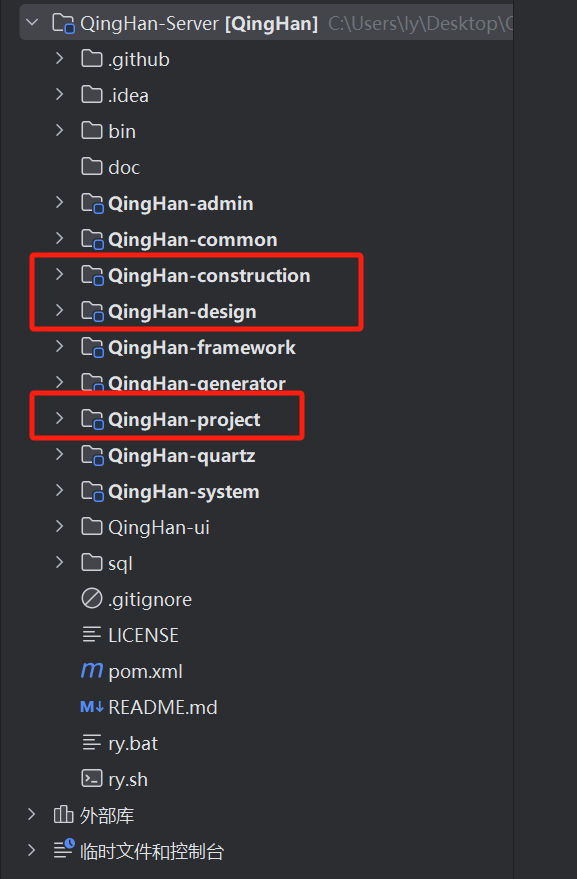
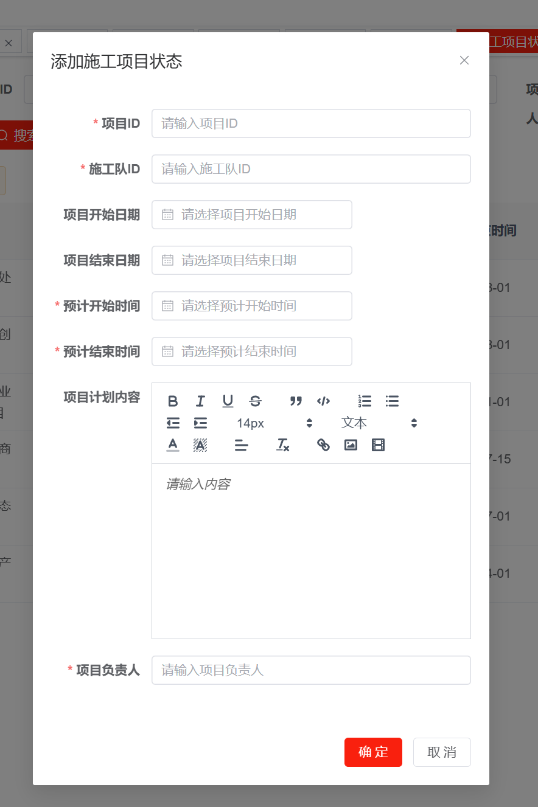

# ruoyi_project-bidding-sys

*Read this in [English](README_en.md).*
## 介绍
ruoyi_project-bidding-sys 是一个基于 [RuoYi](https://github.com/yangzongzhuan)框架实现的项目投标管理系统，包含了**Web前端、小程序、后端与数据库表结构设计**，小程序为投标客户端，Web为系统管理端。项目实现了小程序及Web端用户注册功能和登录功能、用户注册账号审核及权限管理、角色管理、人员管理；实现了Web管理端的项目新建、项目修改、项目审核发布；实现了小程序客户端参与投标业务中的项目信息查看、项目参加、项目实施过程照片及附件上传等。

#### 用户分类
##### 1.平台管理人员 Web：
1) 项目管理人员：负责项目合同上传、图纸上传，成本测算，发布投资方案、项目请款
2) 施工管理人员：负责施工班组遴选，控制施工人工成本及措施费用、控制进度及质量
3) 数据维护人员
##### 2.项目投资人 uni-app：
前期项目跟投，确定跟投项目后开发查阅权限，可看到合同进度、工程现场进度、结算进度，及项目数据分析报告
##### 3.项目实施负责人 uni-app：
前期项目分包报价，选中为项目供应商后仅开发现场施工模块，负责现场动态视频摄像头的安装、静态图片的上传（如技术交底、安全会议等）
##### 4.甲方项目管理人员 uni-app：
仅开发现场视频及照片查阅权限

#### 施工队 uni-app
1. 项目融资完成后，进入施工管理阶段，由施工管理人员在平台下选择施工团队，明确班组人员。
2. 施工管理人员编制及上传施工计划；
3. 项目开工后，施工管理人员发布每天施工内容及进度；以时间轴为序，动态更新；
4. 施工管理人员实施质量监控：上传形象进度现场照片；
5. 施工管理人员：上传项目验收过程文件（以附件形式）

#### 设计队 uni-app
1. 项目融资完成后，进入设计管理阶段，由设计管理人员在平台下选择设计团队，明确各专业设计人员。
2. 设计管理人员编制及上传设计计划；
3. 项目开工后，设计管理人员定期发布设计阶段性成果内容及进度；以时间轴为序，动态更新；
4. 设计管理人员：上传项目验收过程文件（以附件形式）

#### 新增数据库表

-----

## 使用方式

### 项目部署
请使用 [RuoYi](https://github.com/yangzongzhuan/RuoYi) 框架进行基础框架部署，部署教程请参考 [RuoYi](https://github.com/yangzongzhuan/RuoYi) 的官方文档。

### 项目结构
模型文件需要安置在指定目录下进行使用，详情请看若依官方视频中配置说明。

为每个业务模块进行了后端的模块管理，为每个核心功能群进行独立模块的创建。

### 运行步骤
[若依官方视频](https://www.bilibili.com/video/BV1pf421B71v/?spm_id_from=333.337.search-card.all.click&vd_source=38a6ca096c69b42b176bdfa0ab4e928c)
1. 配置相关设置（mysql、Redis）
2. 启动Redis
3. 启动后端服务(ruoyi_project-bidding-sys\Server\QingHan-admin\src\main\java\com\QingHan\QingHanApplication.java)
4. 启动Web端服务(Vue3文件夹打开编辑器终端npm run dev)
5. 启动uni-app端服务(运行APP文件夹项目)

-----
## 运行展示

-----
## 协议
本仓库的代码依照 [Apache-2.0](LICENSE) 协议开源，

-----
## 致谢
对项目使用到的RuoYi开源组件的作者们表示感谢
- [RuoYi-Sever](https://github.com/yangzongzhuan/RuoYi)
- [RuoYi-App](https://github.com/yangzongzhuan/RuoYi-App)
- [RuoYi-Vue3](https://github.com/yangzongzhuan/RuoYi-Vue3)

- [RuoYi-Gitee主页](https://gitee.com/y_project)
- [RuoYi-Sever(Gitee)](https://gitee.com/y_project/RuoYi)
- [RuoYi-App(Gitee)](https://gitee.com/y_project/RuoYi-App)
- [RuoYi-Vue(Gitee)](https://gitee.com/y_project/RuoYi-Vue)

- [RuoYi在线体验](http://vue.ruoyi.vip)
- [黑马程序员bilibili](https://space.bilibili.com/37974444)
