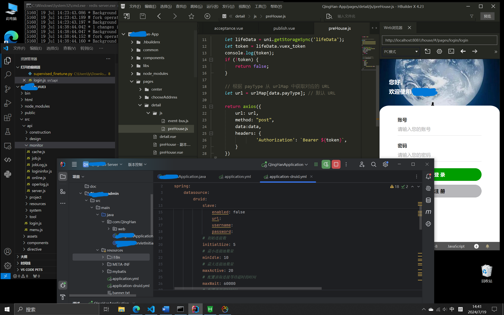
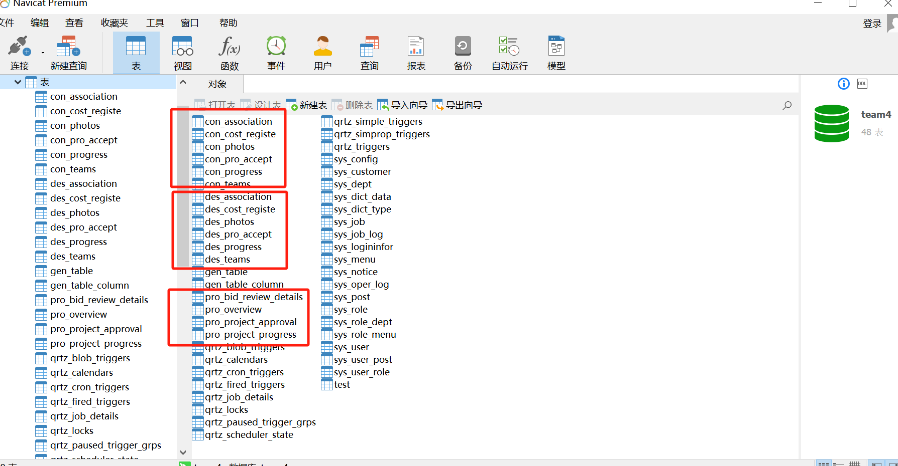
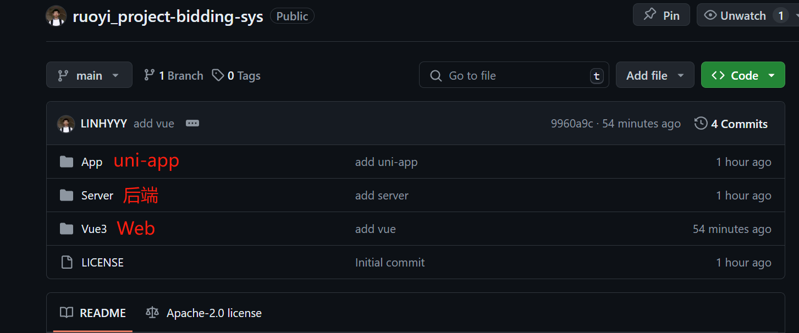
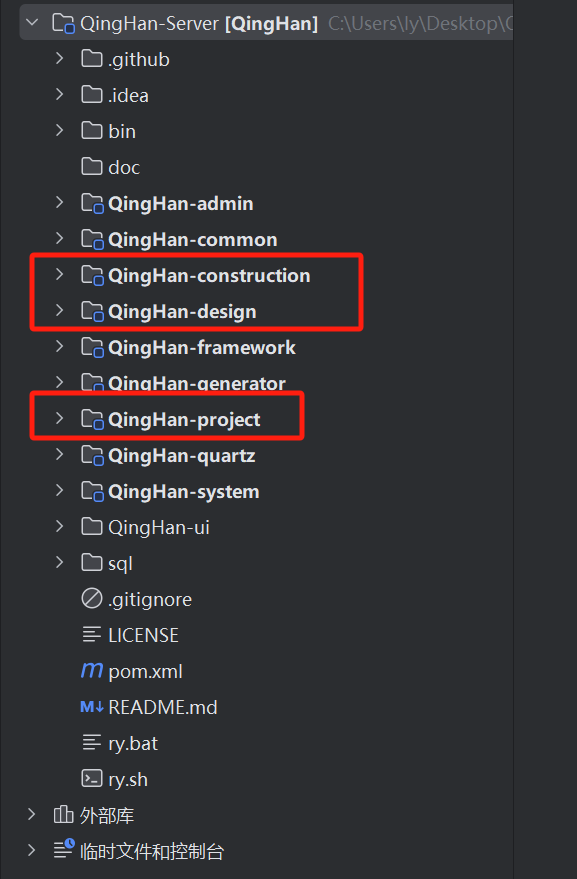
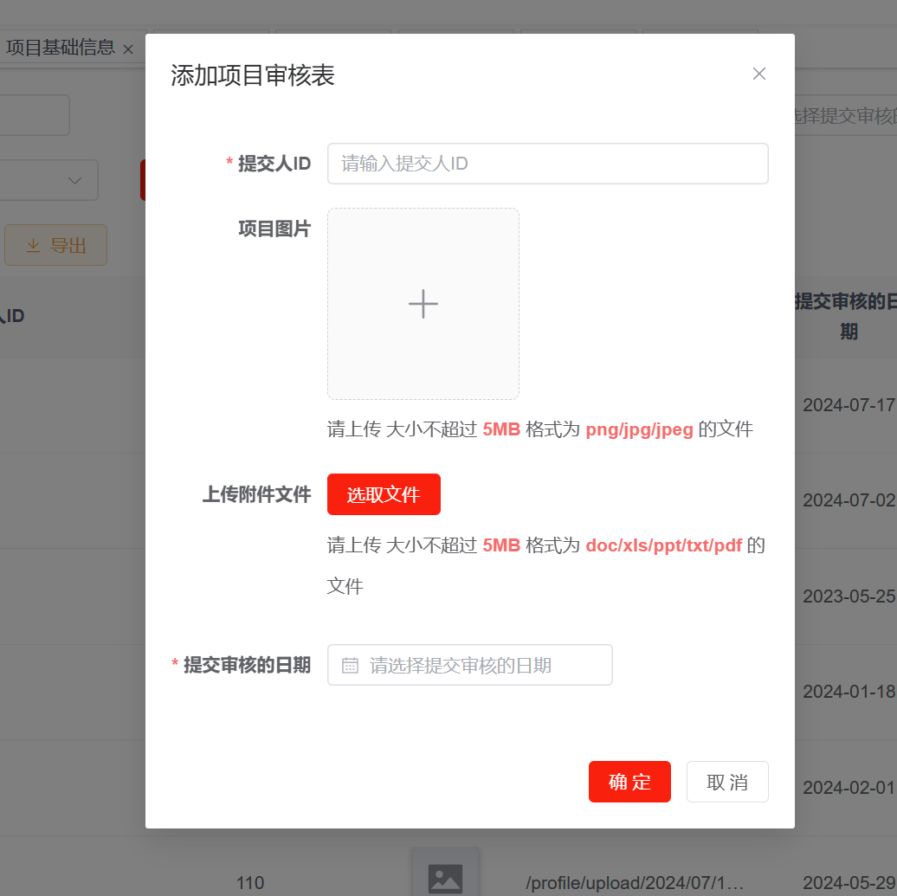
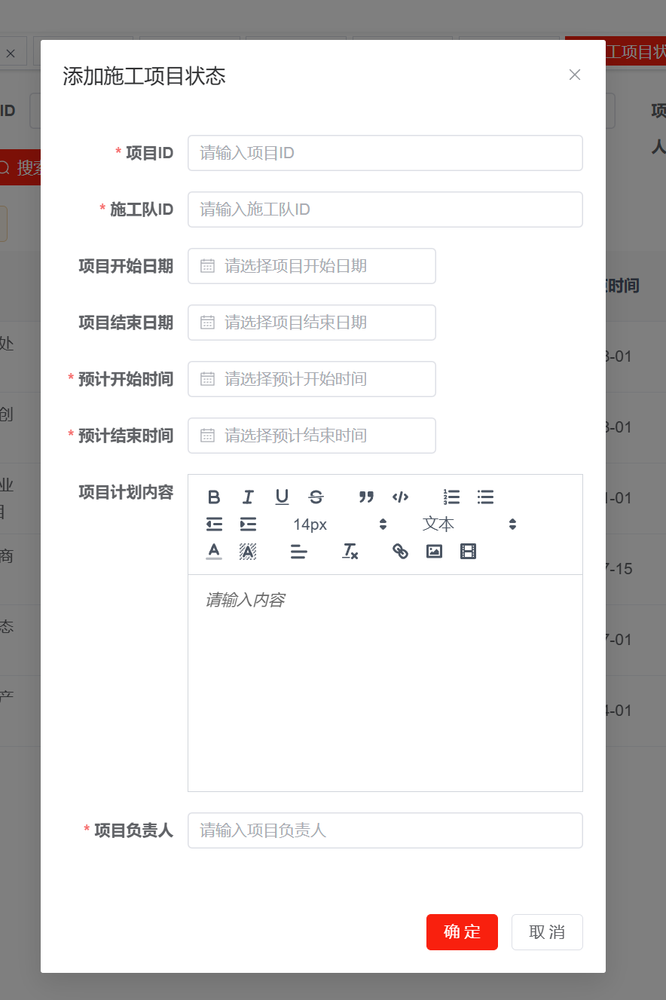
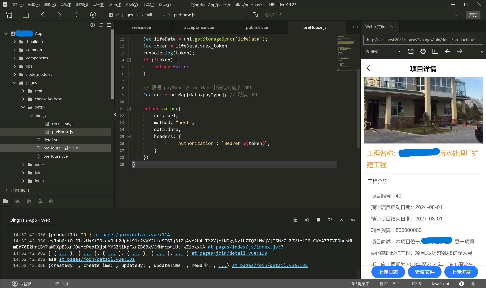
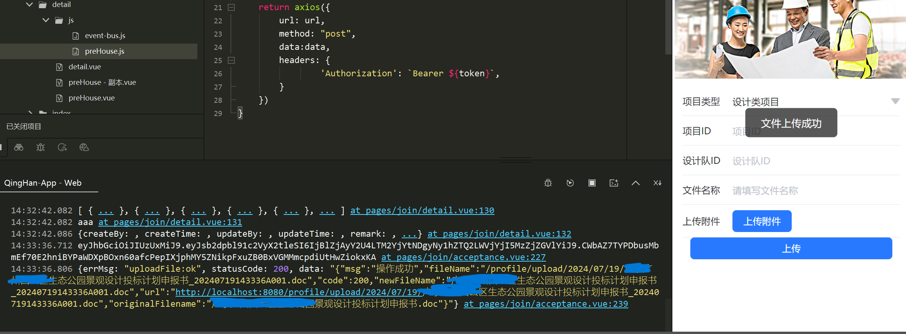

# ruoyi_project-bidding-sys

*Read this in [中文](README.md).*
## 介绍
ruoyi_project-bidding-sys is a project bidding management system based on the [RuoYi](https://github.com/yangzongzhuan) framework, including the design of **Web front-end, applet, back-end and database table structure**, applet is the bidding client, and Web is the system management end. The project realizes the user registration function and login function of the applet and the web side, the review of the user registration account and the management of permissions, the management of roles, and the management of personnel; Realize the new project, project modification, project review and release on the web management side; It realizes the project information viewing, project participation, and uploading photos and attachments of the project implementation process in the bidding business of the Mini Program client.

#### User Classification
##### 1. Platform Managers Web:
1) Project management personnel: responsible for uploading project contracts, drawings, cost calculations, issuing investment plans, and requesting money for projects
2) Construction management personnel: responsible for the selection of construction teams, control construction labor costs and measure costs, control progress and quality
3) Data Maintainers
##### 2. Project Investor uni-app:
In the early stage of project co-investment, after the co-investment project is determined, the development and access permissions can be seen, and the contract progress, project site progress, settlement progress, and project data analysis report can be seen
##### 3. Project Implementation Leader uni-app:
In the early stage of the project subcontracting quotation, only the on-site construction module will be developed after being selected as the project supplier, and will be responsible for the installation of on-site dynamic video cameras and the upload of static pictures (such as technical disclosure, safety meetings, etc.)
##### 4. Party A's project management personnel uni-app:
Only the on-site video and photo viewing rights are developed

#### Construction team uni-app
1. After the project financing is completed, it will enter the construction management stage, and the construction management personnel will select the construction team under the platform and clarify the team members.
2. The construction management personnel prepare and upload the construction plan;
3. After the project starts, the construction management personnel will release the daily construction content and progress; Dynamically updated in chronological order;
4. The construction management personnel implement quality monitoring: upload on-site photos of image progress;
5. Construction management personnel: upload project acceptance process documents (in the form of attachments)

#### Design team uni-app
1. After the project financing is completed, it will enter the design management stage, and the design management personnel will select the design team under the platform and clarify the professional designers.
2. Design management personnel prepare and upload design plans;
3. After the project starts, the design management personnel regularly release the content and progress of the design phased results; Dynamically updated in chronological order;
4. Design management personnel: upload the project acceptance process documents (in the form of attachments)

#### Added database tables

-----

## How to use

### Project deployment
Please use the [RuoYi](https://github.com/yangzongzhuan/RuoYi) framework for basic framework deployment, and please refer to the official documentation of [RuoYi](https://github.com/yangzongzhuan/RuoYi) for deployment tutorials.

### Project structure
The model file needs to be placed in a specified directory for use, please refer to the configuration instructions in the official video for details.

The back-end module management is carried out for each business module, and the independent module is created for each core functional group.

### Run Steps
[Ruoyi Official Video](https://www.bilibili.com/video/BV1pf421B71v/?spm_id_from=333.337.search-card.all.click&vd_source=38a6ca096c69b42b176bdfa0ab4e928c)
1. Configure related settings (mysql, Redis)
2. Start Redis
3. Start the backend service (ruoyi_project-bidding-sysServerQingHan-adminsrcmainjavacomQingHanQingHanApplication.java)
4. Start the web service (Vue3 folder opens the editor terminal npm run dev)
5. Start the uni-app service (run the APP folder project)

-----
## Run the showcase

-----
## Protocol
The code of this repository is open source under the [Apache-2.0](LICENSE) license.

-----
## Thanks
I would like to express my gratitude to the authors of the RuoYi open source components used in the project
- [RuoYi-Sever](https://github.com/yangzongzhuan/RuoYi)
- [RuoYi-App](https://github.com/yangzongzhuan/RuoYi-App)
- [RuoYi-Vue3](https://github.com/yangzongzhuan/RuoYi-Vue3)

- [RuoYi-Gitee](https://gitee.com/y_project)
- [RuoYi-Sever(Gitee)](https://gitee.com/y_project/RuoYi)
- [RuoYi-App(Gitee)](https://gitee.com/y_project/RuoYi-App)
- [RuoYi-Vue(Gitee)](https://gitee.com/y_project/RuoYi-Vue)

- [RuoYi Online experience](http://vue.ruoyi.vip)
- [黑马程序员 bilibili](https://space.bilibili.com/37974444)